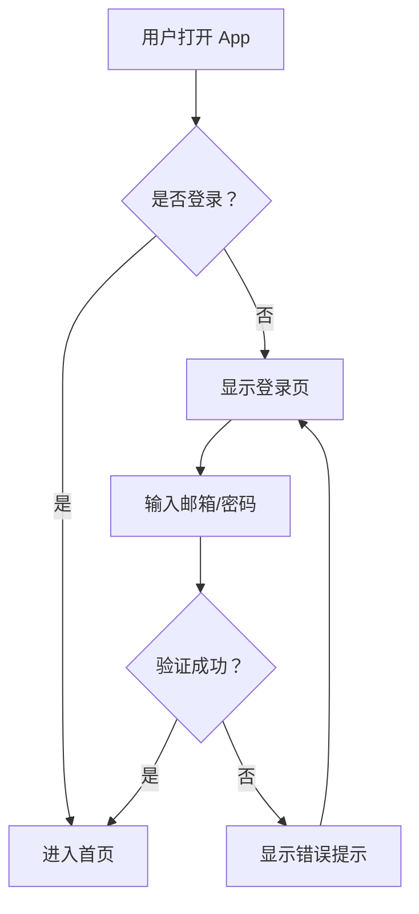
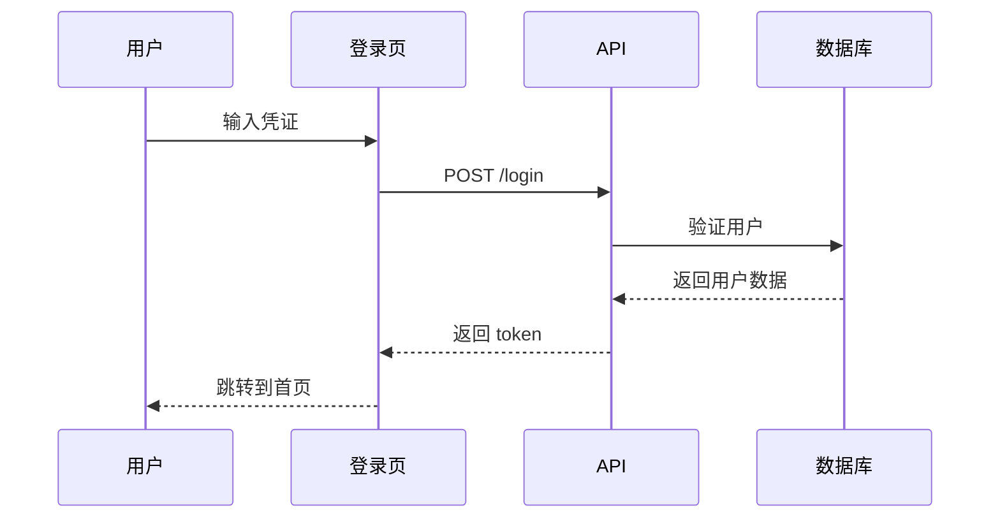

# 设计工具协议

设计专家 Agent 使用的工具集，用于创建 UI 设计图、线框图和原型。

## 工具概览

| 工具 | 用途 | MCP 支持 | 输出格式 |
|------|------|----------|----------|
| **Figma** | 高保真 UI 设计 | ✅ | Figma 文件、PNG、SVG |
| **Excalidraw** | 线框图、草图 | ✅ | PNG、SVG、JSON |
| **Mermaid** | 流程图、架构图 | ✅ | PNG、SVG |
| **PlantUML** | UML 图 | ⚠️ | PNG、SVG |
| **HTML/CSS** | 可交互原型 | ⚠️ | HTML 文件 |

## 1. Excalidraw 集成

### 安装
```bash
npm install -g @excalidraw/cli
```

### 使用示例

```python
from protocols.mcp.client import MCPClient

# 连接 Excalidraw MCP
client = MCPClient(["npx", "-y", "@excalidraw/mcp"])

# 创建线框图
result = await client.call_tool("create_scene", {
    "elements": [
        {
            "type": "rectangle",
            "x": 100,
            "y": 100,
            "width": 200,
            "height": 100,
            "strokeColor": "#000000",
            "backgroundColor": "#15cfff"
        },
        {
            "type": "text",
            "x": 150,
            "y": 140,
            "text": "登录按钮",
            "fontSize": 16
        }
    ],
    "appState": {
        "viewBackgroundColor": "#ffffff"
    }
})

# 导出为图片
await client.call_tool("export_png", {
    "file_id": result["file_id"],
    "scale": 2
})
```

### 线框图模板

#### 登录页面线框图
```json
{
  "type": "excalidraw",
  "elements": [
    {"type": "rectangle", "x": 100, "y": 50, "width": 300, "height": 400, "label": "登录容器"},
    {"type": "rectangle", "x": 120, "y": 100, "width": 260, "height": 40, "label": "邮箱输入框"},
    {"type": "rectangle", "x": 120, "y": 160, "width": 260, "height": 40, "label": "密码输入框"},
    {"type": "rectangle", "x": 120, "y": 240, "width": 260, "height": 50, "label": "登录按钮", "backgroundColor": "#007AFF"},
    {"type": "text", "x": 200, "y": 265, "text": "登录", "color": "#ffffff"}
  ]
}
```

## 2. Mermaid 集成

### 流程图示例



### 序列图示例



### 使用方式

```python
import mermaid

# 定义流程图
diagram = '''
graph LR
    A[首页] --> B[产品列表]
    B --> C[产品详情]
    C --> D[购物车]
'''

# 渲染为图片
mermaid.render('user_flow', diagram)
```

## 3. Figma 集成

### 配置

```bash
export FIGMA_API_KEY="your_token_here"
```

### 设计组件创建

```python
from protocols.mcp.client import MCPClient

figma = MCPClient(["npx", "-y", "@figma/mcp-server"])

# 创建设计框架
frame = await figma.call_tool("create_frame", {
    "file_key": "figma_file_key",
    "name": "Login Screen",
    "x": 0,
    "y": 0,
    "width": 375,
    "height": 812
})

# 添加按钮组件
button = await figma.call_tool("create_component", {
    "file_key": "figma_file_key",
    "parent_id": frame["id"],
    "name": "Login Button",
    "type": "RECTANGLE",
    "fills": [{"type": "SOLID", "color": {"r": 0, "g": 0.48, "b": 1}}]
})

# 导出设计
export = await figma.call_tool("export_image", {
    "file_key": "figma_file_key",
    "node_id": button["id"],
    "format": "PNG",
    "scale": 2
})
```

## 4. HTML/CSS原型生成

### 模板

```html
<!DOCTYPE html>
<html lang="zh-CN">
<head>
    <meta charset="UTF-8">
    <meta name="viewport" content="width=device-width, initial-scale=1.0">
    <title>登录页面 - 原型</title>
    <script src="https://cdn.tailwindcss.com"></script>
</head>
<body class="bg-gray-100 min-h-screen flex items-center justify-center">
    <div class="bg-white p-8 rounded-lg shadow-md w-full max-w-md">
        <h1 class="text-2xl font-bold text-center mb-8">登录</h1>
        
        <form>
            <div class="mb-4">
                <label class="block text-gray-700 mb-2">邮箱</label>
                <input type="email" class="w-full px-4 py-2 border rounded-lg focus:outline-none focus:border-blue-500">
            </div>
            
            <div class="mb-6">
                <label class="block text-gray-700 mb-2">密码</label>
                <input type="password" class="w-full px-4 py-2 border rounded-lg focus:outline-none focus:border-blue-500">
            </div>
            
            <button type="submit" class="w-full bg-blue-500 text-white py-2 rounded-lg hover:bg-blue-600">
                登录
            </button>
        </form>
    </div>
</body>
</html>
```

### 生成方式

```python
def generate_login_prototype():
    return '''
    <!DOCTYPE html>
    <html>
    ... (HTML 内容)
    </html>
    '''

# 保存到文件
with open("prototype/login.html", "w") as f:
    f.write(generate_login_prototype())
```

## 设计专家完整工作流

```
┌─────────────────┐
│  Writer Agent   │
│  需求文档       │
└────────┬────────┘
         │
         ▼
┌─────────────────┐
│ Designer Agent  │
│  1. 分析需求    │
│  2. 信息架构    │
│  3. 用户流程    │
└────────┬────────┘
         │
         ▼
┌─────────────────┐
│  Excalidraw     │
│  线框图         │
└────────┬────────┘
         │
         ▼
┌─────────────────┐
│    Figma        │
│  高保真设计     │
└────────┬────────┘
         │
         ▼
┌─────────────────┐
│  输出交付物     │
│  - Figma 链接    │
│  - PNG/SVG      │
│  - 设计规范     │
│  - HTML 原型     │
└─────────────────┘
```

## 快速开始示例

### 创建登录页面设计

```python
# 1. 创建线框图 (Mermaid)
wireframe = """
graph TD
    A[登录页面] --> B[输入邮箱]
    A --> C[输入密码]
    B --> D[点击登录]
    C --> D
    D --> E{验证}
    E -->|成功 | F[首页]
    E -->|失败 | G[错误提示]
"""

# 2. 创建高保真设计 (Figma)
# 使用 Figma MCP 创建设计组件

# 3. 导出资源
# 导出 PNG/SVG 供开发使用

# 4. 生成 HTML 原型
# 创建可交互的原型用于演示
```

## 参考资源

- [Excalidraw 文档](https://docs.excalidraw.com)
- [Mermaid 文档](https://mermaid.js.org)
- [Figma API 文档](https://www.figma.com/developers/api)
- [Tailwind CSS](https://tailwindcss.com)
