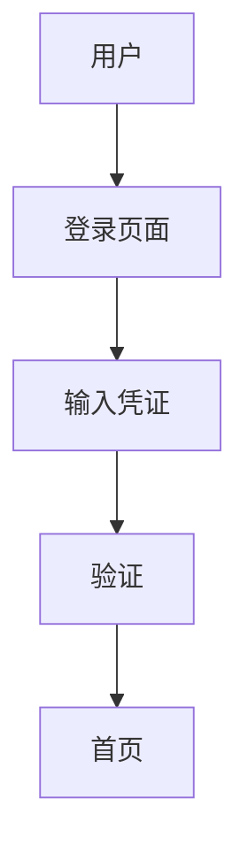

# Figma MCP 协议实现

Figma MCP 用于智能体与 Figma 设计工具的集成，实现 UI 设计图的自动生成和管理。

## 配置 Figma API

### 1. 获取 Figma Personal Access Token

1. 登录 Figma (https://www.figma.com)
2. 进入 Settings → Account
3. 滚动到 "Personal access tokens"
4. 点击 "Create new token"
5. 复制并保存 token

### 2. 设置环境变量

```bash
export FIGMA_API_KEY="your_figma_token_here"
```

### 3. 在集群配置中添加

```json
{
  "protocols": {
    "mcp": {
      "servers": ["figma"]
    }
  },
  "agents": {
    "designer": {
      "mcp_servers": ["figma", "filesystem"]
    }
  }
}
```

## 使用示例

### 连接到 Figma MCP 服务器

```python
from protocols.mcp.client import MCPClient

# 连接到 Figma MCP 服务器
client = MCPClient([
    "npx", "-y",
    "@figma/mcp-server"
])

# 列出可用工具
tools = await client.list_tools()
```

### 常用 Figma MCP 工具

#### 1. 获取文件信息
```python
result = await client.call_tool("get_file_info", {
    "file_key": "your_file_key",
    "version": "latest"
})
```

#### 2. 获取组件
```python
result = await client.call_tool("get_components", {
    "file_key": "your_file_key",
    "node_name": "Button"
})
```

#### 3. 创建设计
```python
result = await client.call_tool("create_component", {
    "file_key": "your_file_key",
    "parent_node_id": "node_123",
    "name": "New Button",
    "type": "FRAME"
})
```

#### 4. 导出资源
```python
result = await client.call_tool("export_image", {
    "file_key": "your_file_key",
    "node_id": "node_456",
    "format": "png",
    "scale": 2
})
```

## 社区 Figma MCP 服务器

### 官方/热门实现

| 服务器 | 安装命令 | 功能 |
|--------|----------|------|
| `@figma/mcp-server` | `npx -y @figma/mcp-server` | 官方 Figma API |
| `@mcp/figma` | `npx -y @mcp/figma` | 社区实现 |
| `figma-design-mcp` | `npm install -g figma-design-mcp` | 增强功能 |

### 使用 npx 直接运行

```bash
# 临时运行
npx -y @figma/mcp-server

# 或在集群配置中
{
  "mcp_servers": ["figma"]
}
```

## 设计专家工作流

### 1. 接收需求文档
```
Writer Agent → [需求文档] → Designer Agent
```

### 2. 分析需求
- 识别功能模块
- 确定界面类型
- 规划用户流程

### 3. 创建线框图 (Excalidraw)
```python
# 使用 Excalidraw MCP 创建线框图
result = await client.call_tool("create_drawing", {
    "elements": [...],
    "appState": {...}
})
```

### 4. 生成高保真设计 (Figma)
```python
# 在 Figma 中创建设计组件
result = await figma_client.call_tool("create_frame", {
    "file_key": figma_file,
    "name": "Login Screen",
    "size": {"width": 375, "height": 812}
})
```

### 5. 输出交付物
- Figma 文件链接
- 导出的 PNG/SVG 资源
- 设计规范文档
- 开发标注

## 备选方案：无 Figma API 时

如果无法使用 Figma API，可以使用以下替代方案：

### 1. Excalidraw (推荐)
- 开源白板工具
- 支持程序化生成
- 可导出 PNG/SVG

```json
{
  "mcp_servers": ["excalidraw"]
}
```

### 2. Mermaid
- 文本生成图表
- 支持流程图、序列图、类图等



### 3. PlantUML
- UML 图生成
- 适合架构图、活动图

### 4. 生成 HTML/CSS 原型
- 直接生成可交互的 HTML 原型
- 使用 Tailwind CSS 快速样式

## 设计输出示例

### 线框图 (Mermaid)


### 设计规范 (JSON)
```json
{
  "colors": {
    "primary": "#007AFF",
    "secondary": "#5856D6",
    "background": "#FFFFFF"
  },
  "fonts": {
    "heading": "Inter Bold",
    "body": "Inter Regular"
  },
  "spacing": {
    "small": "8px",
    "medium": "16px",
    "large": "24px"
  }
}
```

## 注意事项

1. **API 限制**: Figma API 有速率限制，注意缓存
2. **文件权限**: 确保 token 有足够权限访问目标文件
3. **版本管理**: 设计文件版本需要妥善管理
4. **协作同步**: 多 Agent 协作时注意设计冲突

## 参考链接

- [Figma REST API 文档](https://www.figma.com/developers/api)
- [Figma MCP Server](https://github.com/figma/mcp-server)
- [Excalidraw](https://excalidraw.com)
- [Mermaid](https://mermaid.js.org)
