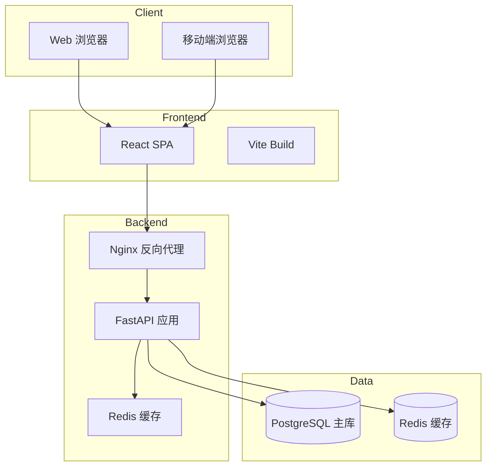
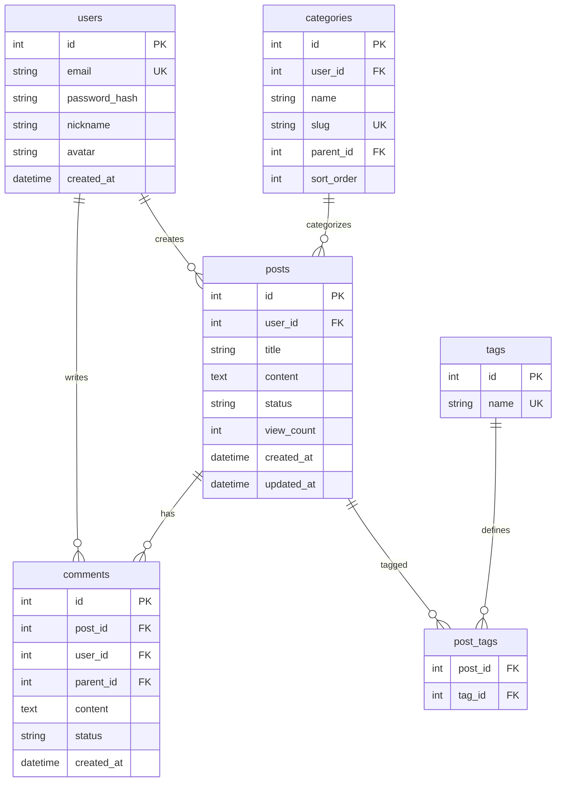

# 🏗️ 技术架构设计文档

**项目名称**: 个人博客系统  
**版本**: 1.0  
**创建时间**: 2026-03-09  
**创建者**: Tech Lead Agent

---

## 1. 架构概述

### 1.1 架构风格
- **类型**: 前后端分离
- **API**: RESTful
- **部署**: 单体应用（初期），可演进为微服务

### 1.2 技术选型

#### 前端技术栈
| 技术 | 选型 | 理由 |
|------|------|------|
| **框架** | React 18 | 生态丰富，组件化好 |
| **语言** | TypeScript 5 | 类型安全，开发体验好 |
| **状态管理** | Zustand | 轻量，易用 |
| **UI 库** | Tailwind CSS | 原子化 CSS，开发快 |
| **构建工具** | Vite | 快速启动，热更新 |
| **Markdown** | React-Markdown | 轻量，可定制 |

#### 后端技术栈
| 技术 | 选型 | 理由 |
|------|------|------|
| **语言** | Python 3.11 | 开发效率高 |
| **框架** | FastAPI | 性能好，自动文档 |
| **ORM** | SQLAlchemy 2.0 | 功能强大，支持异步 |
| **认证** | JWT (PyJWT) | 无状态，易扩展 |
| **数据库** | PostgreSQL 15 | 稳定可靠，功能强 |
| **缓存** | Redis 7 | 高性能缓存 |

#### 基础设施
| 技术 | 选型 | 理由 |
|------|------|------|
| **容器** | Docker | 环境一致 |
| **部署** | Docker Compose | 简单易用 |
| **CI/CD** | GitHub Actions | 免费，集成好 |
| **监控** | Prometheus + Grafana | 开源，功能强 |

---

## 2. 系统架构图



---

## 3. API 接口设计

### 3.1 API 规范

**Base URL**: `/api/v1`  
**认证方式**: Bearer Token (JWT)  
**数据格式**: JSON  
**字符编码**: UTF-8

### 3.2 核心接口

#### 用户认证

| 接口 | 方法 | 描述 | 认证 |
|------|------|------|------|
| `/auth/register` | POST | 用户注册 | ❌ |
| `/auth/login` | POST | 用户登录 | ❌ |
| `/auth/logout` | POST | 用户登出 | ✅ |
| `/auth/refresh` | POST | 刷新 Token | ✅ |

**请求示例** - 登录:
```json
POST /api/v1/auth/login
{
  "email": "user@example.com",
  "password": "password123"
}

Response:
{
  "access_token": "eyJhbGciOiJIUzI1NiIs...",
  "refresh_token": "eyJhbGciOiJIUzI1NiIs...",
  "token_type": "Bearer",
  "expires_in": 3600
}
```

#### 文章管理

| 接口 | 方法 | 描述 | 认证 |
|------|------|------|------|
| `/posts` | GET | 获取文章列表 | ❌ |
| `/posts/{id}` | GET | 获取文章详情 | ❌ |
| `/posts` | POST | 创建文章 | ✅ |
| `/posts/{id}` | PUT | 更新文章 | ✅ |
| `/posts/{id}` | DELETE | 删除文章 | ✅ |

**请求示例** - 创建文章:
```json
POST /api/v1/posts
Authorization: Bearer {token}
{
  "title": "我的第一篇文章",
  "content": "# Hello World\n\n这是内容...",
  "category_id": 1,
  "tags": ["python", "fastapi"],
  "status": "published"
}
```

#### 分类管理

| 接口 | 方法 | 描述 | 认证 |
|------|------|------|------|
| `/categories` | GET | 获取分类列表 | ❌ |
| `/categories` | POST | 创建分类 | ✅ |
| `/categories/{id}` | PUT | 更新分类 | ✅ |
| `/categories/{id}` | DELETE | 删除分类 | ✅ |

#### 评论系统

| 接口 | 方法 | 描述 | 认证 |
|------|------|------|------|
| `/posts/{id}/comments` | GET | 获取评论列表 | ❌ |
| `/posts/{id}/comments` | POST | 发表评论 | ✅ |
| `/comments/{id}` | DELETE | 删除评论 | ✅ |
| `/comments/{id}/like` | POST | 点赞评论 | ✅ |

---

## 4. 数据库设计

### 4.1 ER 图



### 4.2 表结构

#### users - 用户表
```sql
CREATE TABLE users (
    id SERIAL PRIMARY KEY,
    email VARCHAR(255) UNIQUE NOT NULL,
    password_hash VARCHAR(255) NOT NULL,
    nickname VARCHAR(100),
    avatar VARCHAR(500),
    is_active BOOLEAN DEFAULT true,
    created_at TIMESTAMP DEFAULT CURRENT_TIMESTAMP,
    updated_at TIMESTAMP DEFAULT CURRENT_TIMESTAMP
);

CREATE INDEX idx_users_email ON users(email);
```

#### posts - 文章表
```sql
CREATE TABLE posts (
    id SERIAL PRIMARY KEY,
    user_id INTEGER REFERENCES users(id) ON DELETE CASCADE,
    title VARCHAR(500) NOT NULL,
    content TEXT NOT NULL,
    status VARCHAR(20) DEFAULT 'draft', -- draft, published, archived
    view_count INTEGER DEFAULT 0,
    category_id INTEGER REFERENCES categories(id),
    created_at TIMESTAMP DEFAULT CURRENT_TIMESTAMP,
    updated_at TIMESTAMP DEFAULT CURRENT_TIMESTAMP
);

CREATE INDEX idx_posts_user_id ON posts(user_id);
CREATE INDEX idx_posts_status ON posts(status);
CREATE INDEX idx_posts_created_at ON posts(created_at DESC);
```

#### categories - 分类表
```sql
CREATE TABLE categories (
    id SERIAL PRIMARY KEY,
    user_id INTEGER REFERENCES users(id) ON DELETE CASCADE,
    name VARCHAR(100) NOT NULL,
    slug VARCHAR(100) UNIQUE NOT NULL,
    parent_id INTEGER REFERENCES categories(id),
    sort_order INTEGER DEFAULT 0,
    created_at TIMESTAMP DEFAULT CURRENT_TIMESTAMP
);

CREATE INDEX idx_categories_user_id ON categories(user_id);
```

#### comments - 评论表
```sql
CREATE TABLE comments (
    id SERIAL PRIMARY KEY,
    post_id INTEGER REFERENCES posts(id) ON DELETE CASCADE,
    user_id INTEGER REFERENCES users(id) ON DELETE SET NULL,
    parent_id INTEGER REFERENCES comments(id),
    content TEXT NOT NULL,
    status VARCHAR(20) DEFAULT 'published', -- published, pending, spam
    like_count INTEGER DEFAULT 0,
    created_at TIMESTAMP DEFAULT CURRENT_TIMESTAMP,
    updated_at TIMESTAMP DEFAULT CURRENT_TIMESTAMP
);

CREATE INDEX idx_comments_post_id ON comments(post_id);
CREATE INDEX idx_comments_parent_id ON comments(parent_id);
```

#### tags - 标签表
```sql
CREATE TABLE tags (
    id SERIAL PRIMARY KEY,
    name VARCHAR(50) UNIQUE NOT NULL,
    created_at TIMESTAMP DEFAULT CURRENT_TIMESTAMP
);
```

#### post_tags - 文章标签关联表
```sql
CREATE TABLE post_tags (
    post_id INTEGER REFERENCES posts(id) ON DELETE CASCADE,
    tag_id INTEGER REFERENCES tags(id) ON DELETE CASCADE,
    PRIMARY KEY (post_id, tag_id)
);
```

---

## 5. 项目结构

```
blog-system/
├── frontend/                 # 前端项目
│   ├── src/
│   │   ├── components/      # 可复用组件
│   │   ├── pages/           # 页面组件
│   │   ├── hooks/           # 自定义 Hooks
│   │   ├── stores/          # 状态管理
│   │   ├── utils/           # 工具函数
│   │   └── App.tsx
│   ├── package.json
│   └── vite.config.ts
│
├── backend/                  # 后端项目
│   ├── app/
│   │   ├── api/             # API 路由
│   │   ├── models/          # 数据模型
│   │   ├── schemas/         # Pydantic Schema
│   │   ├── services/        # 业务逻辑
│   │   ├── utils/           # 工具函数
│   │   └── main.py
│   ├── tests/               # 测试代码
│   ├── requirements.txt
│   └── Dockerfile
│
├── docker-compose.yml        # Docker 编排
└── README.md
```

---

## 6. 安全设计

### 6.1 认证授权
- **JWT Token**: Access Token (1 小时) + Refresh Token (7 天)
- **密码加密**: bcrypt (cost=12)
- **权限控制**: 基于角色的访问控制 (RBAC)

### 6.2 数据安全
- **SQL 注入**: 使用 ORM，参数化查询
- **XSS 防护**: 输入过滤，输出转义
- **CSRF 防护**: CSRF Token
- **CORS**: 严格限制允许的源

### 6.3 接口安全
- **速率限制**: 每 IP 每分钟 60 次请求
- **输入验证**: Pydantic Schema 验证
- **错误处理**: 统一错误格式，不泄露敏感信息

---

## 7. 性能优化

### 7.1 缓存策略
- **Redis 缓存**: 热门文章、分类列表
- **CDN**: 静态资源（图片、CSS、JS）
- **数据库索引**: 常用查询字段建立索引

### 7.2 数据库优化
- **连接池**: SQLAlchemy 连接池 (size=20)
- **查询优化**: 避免 N+1 查询，使用 JOIN
- **分页**: 游标分页，避免 OFFSET

### 7.3 前端优化
- **代码分割**: 路由级代码分割
- **懒加载**: 图片懒加载
- **缓存**: Service Worker 缓存

---

## 8. 部署方案

### 8.1 开发环境
```bash
docker-compose up -d
# 启动：PostgreSQL, Redis, Backend, Frontend
```

### 8.2 生产环境
```yaml
services:
  nginx:
    image: nginx:alpine
    ports:
      - "80:80"
      - "443:443"
  
  backend:
    build: ./backend
    environment:
      - DATABASE_URL=postgresql://...
      - REDIS_URL=redis://...
    deploy:
      replicas: 2
  
  frontend:
    build: ./frontend
    depends_on:
      - backend
  
  postgres:
    image: postgres:15
    volumes:
      - pgdata:/var/lib/postgresql/data
  
  redis:
    image: redis:7-alpine
```

---

## 9. 监控告警

### 9.1 监控指标
- **应用监控**: QPS、响应时间、错误率
- **系统监控**: CPU、内存、磁盘
- **业务监控**: 日活、文章数、评论数

### 9.2 告警规则
- 错误率 > 5% → P1 告警
- 响应时间 > 2s → P2 告警
- 服务不可用 → P0 告警

---

**文档版本**: v1.0  
**最后更新**: 2026-03-09  
**审核状态**: 待评审
